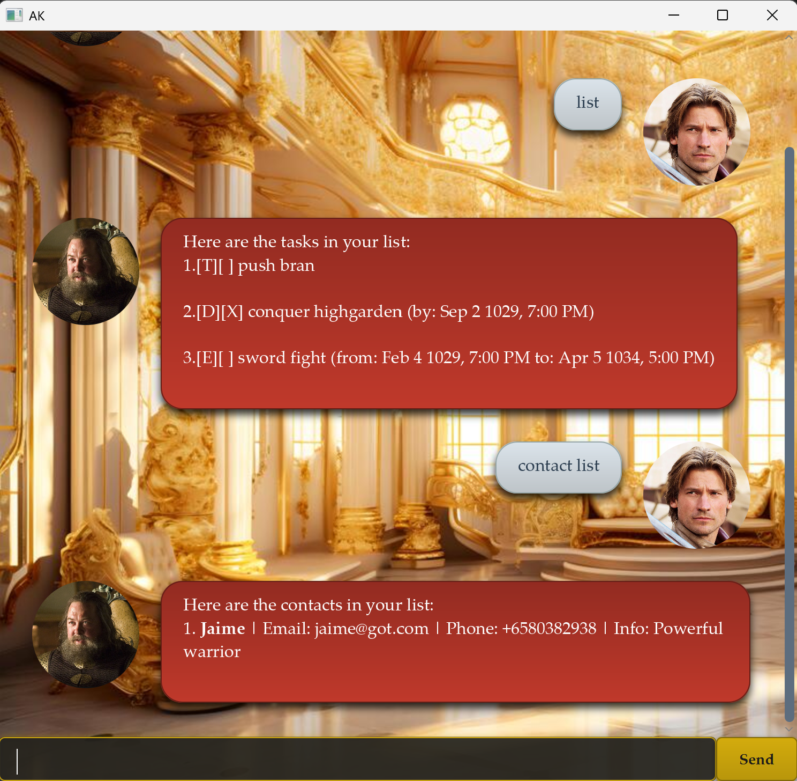

# AK - The Chatbot of Ice and Fire
> *"I drink and I know things."* - AK

AK is a powerful task management chatbot wrapped in a **Game of Thrones** aesthetic. It serves as your personal Hand of the Code, managing your tasks and contacts with the wit of Tyrion Lannister and the precision of a Maester.

## 📖 Table of Contents
*   [Quick Start](#quick-start)
*   [Features](#features)
    *   [Adding Tasks](#adding-tasks)
    *   [Managing Tasks](#managing-tasks)
    *   [The Address Book (Contacts)](#the-address-book)
    *   [Finding Things](#finding-things)
*   [Command Summary](#command-summary)
*   [Strict Rules of the Citadel](#strict-rules-of-the-citadel)

## ⚡ Quick Start

1.  Ensure you have Java `17` or above installed.
2.  Download the latest `ak.jar` from the [latest release](https://github.com/AK-matrix/ip/releases/tag/A-Release/ak.jar).
3.  Double-click the file to summon AK.
4.  Type commands in the box and press Enter. AK will respond in kind.

## ⚔️ Features

> **Note:** Parameters in `<angle_brackets>` are mandatory. Parameters in `[square_brackets]` are optional.

### Adding Tasks
*"A new burden for the realm."*

#### 1. Todo (`todo`)
Adds a simple task to your list.
*   **Format:** `todo <description>`
*   **Example:** `todo Pay the Iron Price`

---

#### 2. Deadline (`deadline`)
Adds a task that must be done by a specific time.
*   **Format:** `deadline <description> /by <yyyy-MM-dd HHmm>`
*   **Example:** `deadline Pay debts to Iron Bank /by 2024-12-31 2359`

---

#### 3. Event (`event`)
Adds a task that occurs within a time frame.
*   **Format:** `event <description> /from <yyyy-MM-dd HHmm> /to <yyyy-MM-dd HHmm>`
*   **Example:** `event Tourney of the Hand /from 2024-06-01 1200 /to 2024-06-01 1800`

---

### Managing Tasks

#### 4. List (`list`)
Displays all pending and completed burdens.
*   **Format:** `list`

---

#### 5. Mark as Done (`mark`)
Marks a task as completed. *"A debt paid."*
*   **Format:** `mark <index>`
*   **Example:** `mark 1`

---

#### 6. Mark as Not Done (`unmark`)
Marks a task as incomplete.
*   **Format:** `unmark <index>`
*   **Example:** `unmark 1`

---

#### 7. Delete (`delete`)
Permanently removes a task. *"Sent to the Wall."*
*   **Format:** `delete <index>`
*   **Example:** `delete 3`

---

### The Address Book
*"A girl has no name... but your contacts must."*

#### 8. Add Contact (`add contact`)
Adds a person to your contact list.
*   **Format:** `add contact n/<name> [p/<phone>] [e/<email>] [i/<info>]`
*   **Example:** `add contact n/Jon Snow p/12345678 e/jon@wall.com i/Knows nothing`

---

#### 9. List Contacts (`contact list`)
Displays your allies and enemies.
*   **Format:** `contact list`

---

#### 10. Edit Contact (`edit contact`)
Updates an existing contact.
*   **Format:** `edit contact <index> [n/<new_name>] [p/<new_phone>] ...`
*   **Example:** `edit contact 1 n/Aegon Targaryen`

---

#### 11. Delete Contact (`delete contact`)
Removes a contact.
*   **Format:** `delete contact <index>`
*   **Example:** `delete contact 2`

---

### Finding Things

#### 12. Find (`find`)
Searches for tasks containing a keyword.
*   **Format:** `find <keyword>`
*   **Example:** `find Dragon`

---

#### 13. Exit (`bye`)
Ends your watch.
*   **Format:** `bye`

---

## 📜 Command Summary

| Action | Format |
| :--- | :--- |
| **Add Todo** | `todo <desc>` |
| **Add Deadline** | `deadline <desc> /by <date>` |
| **Add Event** | `event <desc> /from <date> /to <date>` |
| **List** | `list` |
| **Mark/Unmark** | `mark <index>` / `unmark <index>` |
| **Delete** | `delete <index>` |
| **Find** | `find <keyword>` |
| **Add Contact** | `add contact n/<name> ...` |
| **Edit Contact** | `edit contact <index> ...` |
| **Del Contact** | `delete contact <index>` |
| **List Contacts**| `contact list` |
| **Exit** | `bye` |

## 🏰 Strict Rules of the Citadel

AK enforces strict rules to keep the realm orderly:

1.  **Strict Dates**: Dates must be real. *February 30th* does not exist, even in Westeros. Use `yyyy-MM-dd HHmm`.
2.  **Logical Events**: An event cannot end before it starts. Time flows forward.
3.  **No Duplicates**: You cannot add the exact same task or contact twice. *"This task already plagues your list."*

*Valar Dohaeris.*
